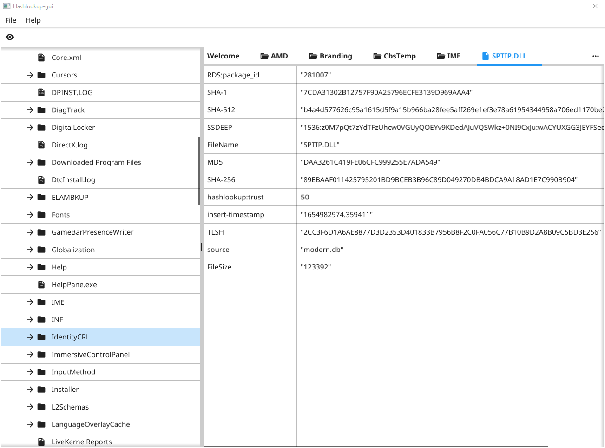
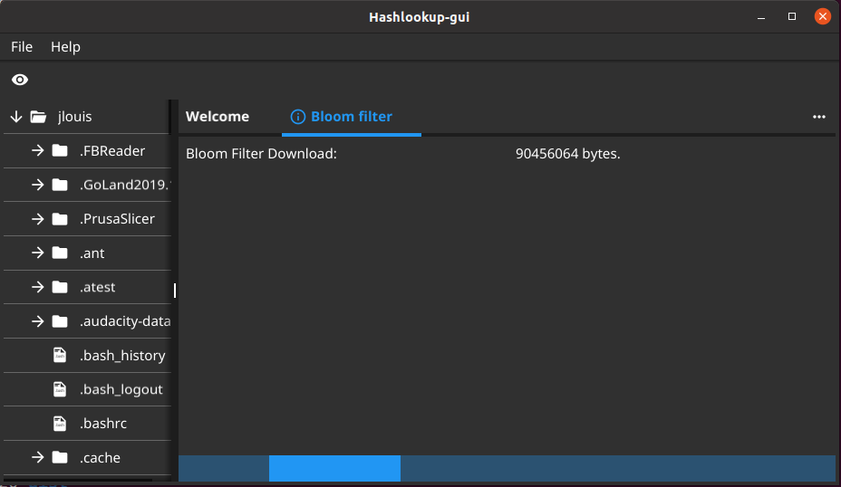
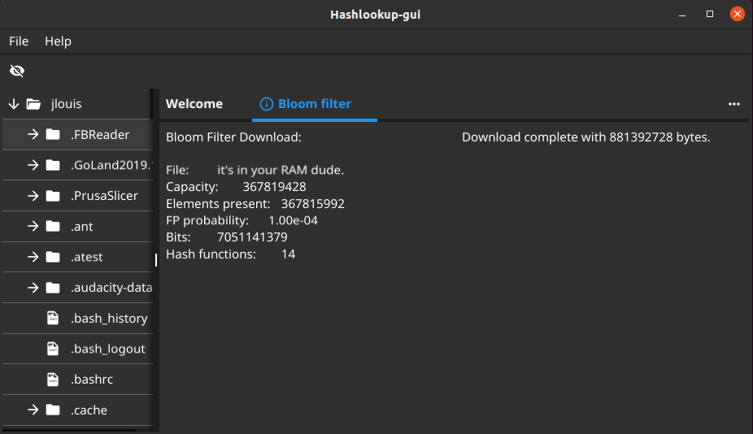
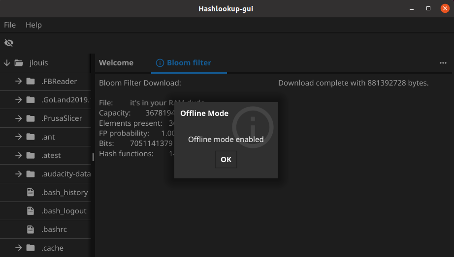
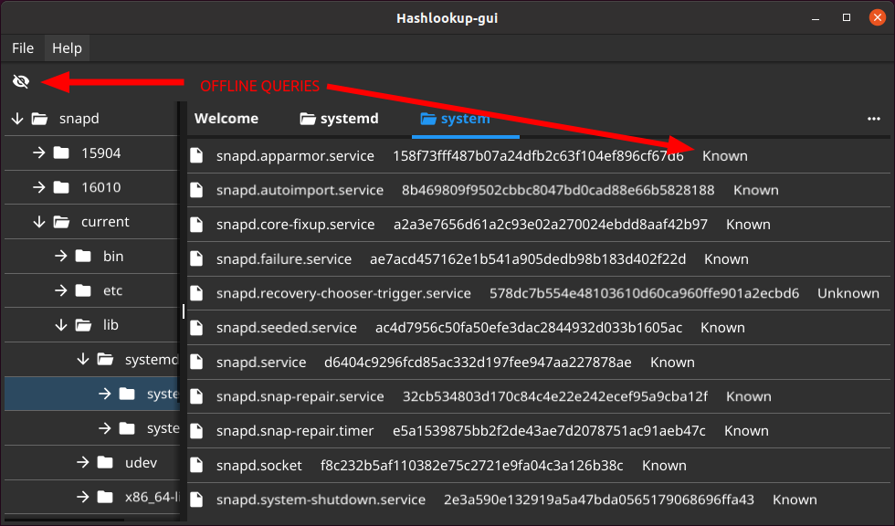

# hashlookup-gui

Provide a multi-platform Graphical User Interface for querying hashlookup services (only [circl's](https://hashlookup.circl.lu) at the moment.)


# Features

- Multi-platform:
  - windows
  - linux
- Binary runs without installation (so from a thumb drive for instance)
- Queries online hashlookup services
- Queries an offline Bloom filter for gaining speed and avoiding leaking known hashes to the hashlookup service
- Downloads bloom filter to a specified file
- Can load bloom filter:
  - from a file
  - straight from remote

# Screenshots






# Installation
- Copy the released binary / packages 
- `go install github.com/hashlookup/hashlookup-gui` should work
- or one can do `git pull` `go build` in the root folder

# Cross-compilation
The project uses [fyne-cross](https://github.com/fyne-io/fyne-cross) to provide cross-compiled binaries and distribution packages, see releases.
To create cross-compiled binaries, install fyne-cross:
```
go get -u github.com/fyne-io/fyne-cross
```
Then in the root folder run:
```
fyne-cross windows
```
Binaries should be available in `./fyne-cross/bin/windows-amd64/`

# Roadmap
- support android, ios, darwin and freebsd
- option for recursively walking folders
- export list of unknown / known files (json, csv)
- export a copy of unknown / known files with metadata (hash, etc.)
- export to network devices
- additional installation methods
- application self-update
- bloom filter update notification
